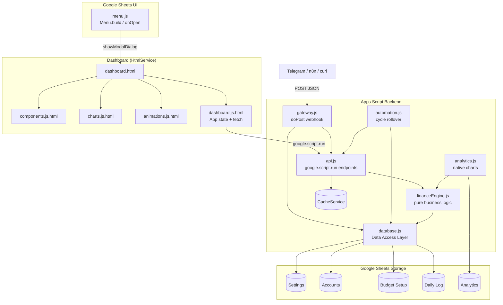

# Architecture Diagram (Mermaid)

Renders natively in GitHub. Source of truth for the component diagram referenced in `docs/ARCHITECTURE.md` and the portfolio case study.

## Legend

- Solid arrows: direct function calls or data reads/writes.
- `Cache`: `CacheService.getDocumentCache()`, keyed per budget cycle, 300s TTL by default.
- `DB`: the only module permitted to call `SpreadsheetApp` (see `CONTRIBUTING.md` module boundaries).
