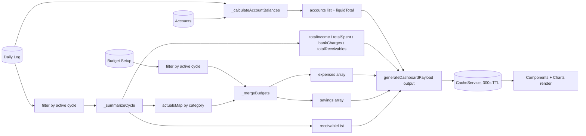

# Data Flow Diagram (Mermaid)

Traces how raw sheet rows become the dashboard payload.

## Notes

- `_calculateAccountBalances` runs over **all** transactions regardless of cycle, since account balances are cumulative, not cycle-scoped.
- `_summarizeCycle` and the budget filters operate only on rows matching `Settings.Active_Cycle` (or the requested cycle override).
- The known From/To Account column issue (`docs/TROUBLESHOOTING.md`) affects the `Balances` step specifically, since it consumes `From Account` / `To Account` by header name regardless of which module wrote the row.
