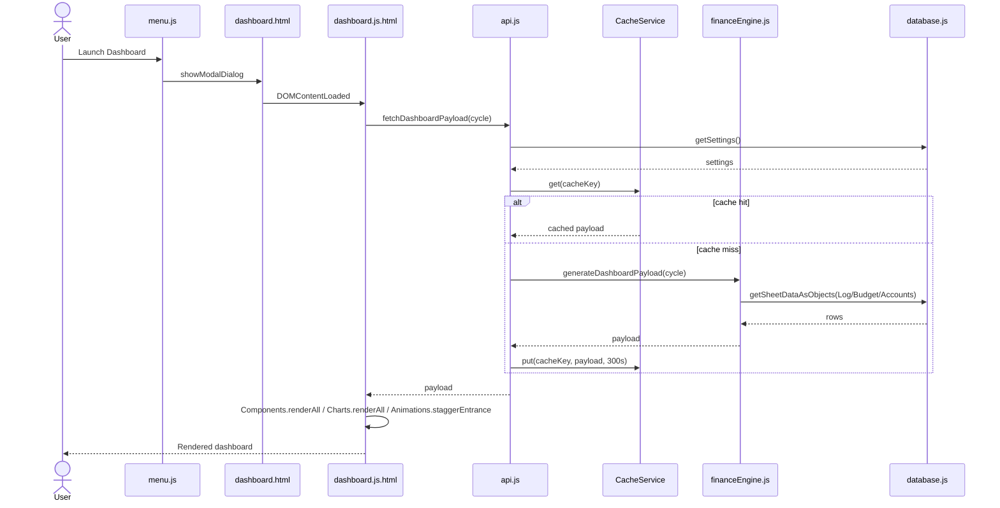
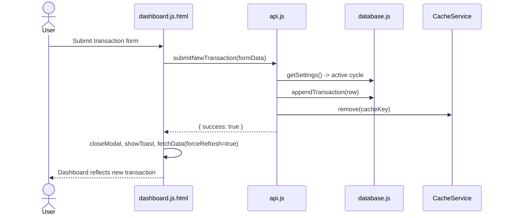
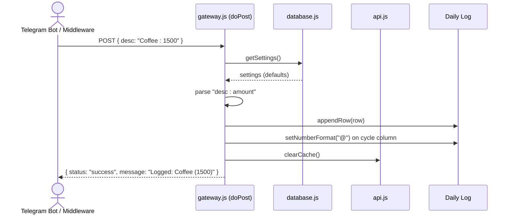

# Sequence Diagrams (Mermaid)

## 1. Dashboard Load

```mermaid
sequenceDiagram
    actor User
    participant Menu as menu.js
    participant HTML as dashboard.html
    participant App as dashboard.js.html
    participant API as api.js
    participant Cache as CacheService
    participant Engine as financeEngine.js
    participant DB as database.js

    User->>Menu: Launch Dashboard
    Menu->>HTML: showModalDialog
    HTML->>App: DOMContentLoaded
    App->>API: fetchDashboardPayload(cycle)
    API->>DB: getSettings()
    DB-->>API: settings
    API->>Cache: get(cacheKey)
    alt cache hit
        Cache-->>API: cached payload
    else cache miss
        API->>Engine: generateDashboardPayload(cycle)
        Engine->>DB: getSheetDataAsObjects(Log/Budget/Accounts)
        DB-->>Engine: rows
        Engine-->>API: payload
        API->>Cache: put(cacheKey, payload, 300s)
    end
    API-->>App: payload
    App->>App: Components.renderAll / Charts.renderAll / Animations.staggerEntrance
    App-->>User: Rendered dashboard
```

## 2. Transaction Submission

```mermaid
sequenceDiagram
    actor User
    participant App as dashboard.js.html
    participant API as api.js
    participant DB as database.js
    participant Cache as CacheService

    User->>App: Submit transaction form
    App->>API: submitNewTransaction(formData)
    API->>DB: getSettings() -> active cycle
    API->>DB: appendTransaction(row)
    API->>Cache: remove(cacheKey)
    API-->>App: { success: true }
    App->>App: closeModal, showToast, fetchData(forceRefresh=true)
    App-->>User: Dashboard reflects new transaction
```

## 3. External Webhook Ingestion

```mermaid
sequenceDiagram
    actor Bot as Telegram Bot / Middleware
    participant GW as gateway.js (doPost)
    participant DB as database.js
    participant API as api.js
    participant Sheet as Daily Log

    Bot->>GW: POST { desc: "Coffee : 1500" }
    GW->>DB: getSettings()
    DB-->>GW: settings (defaults)
    GW->>GW: parse "desc : amount"
    GW->>Sheet: appendRow(row)
    GW->>Sheet: setNumberFormat("@") on cycle column
    GW->>API: clearCache()
    GW-->>Bot: { status: "success", message: "Logged: Coffee (1500)" }
```
